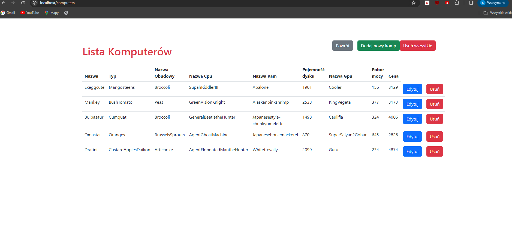
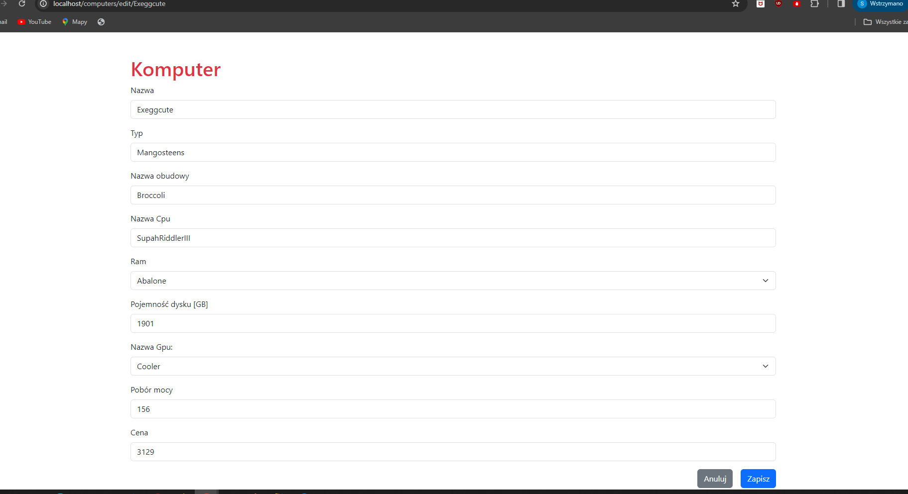

# MWO_PROJEKT

## Aplikacja MVC

Do zrealizowania projektu powstała aplikacja webowa typu MVC. 
Kod został napisany i przetestowany w JDK 17 przy użyciu frameworka Spring-Boot oraz narzędzia Selenium.
Aplikacja wykorzystuje 3 encje przechowywane w bazie danych PostgreSQL: 
* Computer
* Gpu
* Ram

Umożliwia ona przerpowadzanie opercaji CRUD przy wykorzystaniu tych zasobów.
Poniżej widoki z aplikacji:



## Testy

Testy zostały wykonane przy wykorzystaniu Selenium z załączonym JUnit5.
Do porównań oczekiwanych wyników z otrzymanymi użyto biblioteki AssertJ.
Do zapewnienia danych testowych użytu narzędzia Faker, bibliotkeki służącej do generowania losowych danych w tym przypadku w sposób deterministyczny przez określone ziarno.
Do obługi sterownika Selenium posłużyło narzędzie bonigarcia.webdrivermenager: https://github.com/bonigarcia/webdrivermanager .

Poniżej konfiguracja Selenium Driver:

```java

@Getter
public class TestConfiguration {

    private final WebDriver testDriver;

    public TestConfiguration() {
        final var configOptions = new ChromeOptions();
        configOptions.addArguments("--no-sandbox");
        configOptions.addArguments("--disable-dev-shm-usage");
        configOptions.addArguments("--headless");
        configOptions.addArguments("--window-size=1920,1080");
        this.testDriver = new ChromeDriver(configOptions);
    }
}
```
Do testów użyty został sterownik dedykowany przeglądarce Chrome / Chromium.

Klasa testowa:

```java

@TestMethodOrder(MethodOrderer.OrderAnnotation.class)
@SpringBootTest(webEnvironment = SpringBootTest.WebEnvironment.DEFINED_PORT)
@ActiveProfiles("test")
public class GpuTest {

    private static final String URL = "http://localhost:8080";
    private final WebDriver driver = new TestConfiguration().getTestDriver();

    @BeforeAll
    static void setupClass() {
        WebDriverManager.chromedriver().setup();
    }

    @BeforeEach
    void setUp() {
        driver.get(URL);
    }

    @AfterEach
    void tearDown() {
        driver.quit();
    }

    @Test
    @Order(1)
    void givenGpuData_whenCreateGpu_thenCreateNewGpu() throws Exception {
        final var gpuName = "TestName";
        final var vRam = "8";
        final var gpusButton = driver.findElement(By.xpath("//*[contains(text(),'Gpus')]"));
        gpusButton.click();
        final var createGpuButton = driver.findElement(By.xpath("//*[contains(text(),'Dodaj nowy Gpu')]"));
        createGpuButton.click();
        final var nameInput = driver.findElement(By.id("name"));
        nameInput.sendKeys(gpuName);
        final var vRamInput = driver.findElement(By.id("videoramcapacity"));
        vRamInput.sendKeys(vRam);
        final var js = (JavascriptExecutor) driver;
        js.executeScript("document.querySelector('button[type=\"submit\"]').click();");
        Thread.sleep(1000);
        final var gpuElement = driver.findElement(By.xpath("//*[contains(text(),'" + gpuName + "')]"));
        assertThat(gpuElement.isDisplayed()).isTrue();
    }

    @Test
    @Order(2)
    void givenSomeGpu_whenEditGpu_thenModifyGpu() throws Exception {
        final var gpuName = "TestName";
        final var gpuNewName = "NewTestName";
        final var gpusButton = driver.findElement(By.xpath("//*[contains(text(),'Gpus')]"));
        gpusButton.click();
        final var editButton = driver.findElement(By.xpath("//td[text()='" + gpuName + "']/following-sibling::td/div/a[text()='Edytuj']"));
        editButton.click();
        final var nameInput = driver.findElement(By.id("name"));
        nameInput.clear();
        nameInput.sendKeys(gpuNewName);
        final var js = (JavascriptExecutor) driver;
        js.executeScript("document.querySelector('button[type=\"submit\"]').click();");
        Thread.sleep(1000);
        final var gpuElement = driver.findElement(By.xpath("//*[contains(text(),'" + gpuNewName + "')]"));
        assertThat(gpuElement.isDisplayed()).isTrue();
    }

    @Test
    @Order(3)
    void givenSomeGpu_whenDeleteGpu_thenGpuIsRemoved() {
        final var gpuName = "NewTestName";
        final var gpusButton = driver.findElement(By.xpath("//*[contains(text(),'Gpus')]"));
        gpusButton.click();
        final var deleteButton = driver.findElement(By.xpath("//td[text()='" + gpuName + "']/following-sibling::td/div/form/button[text()='Usuń']"));
        deleteButton.click();
        final var gpuElement = driver.findElements(By.xpath("//*[contains(text(),'" + gpuName + "')]"));
        assertThat(gpuElement.isEmpty()).isTrue();
    }
}
```
Ze względu na problemy techniczne nie wykonałem połączenia z GitHub Actions.

Poniżej link do prezentacji testów Selenium :

https://youtu.be/vwT2j9xc3kI
